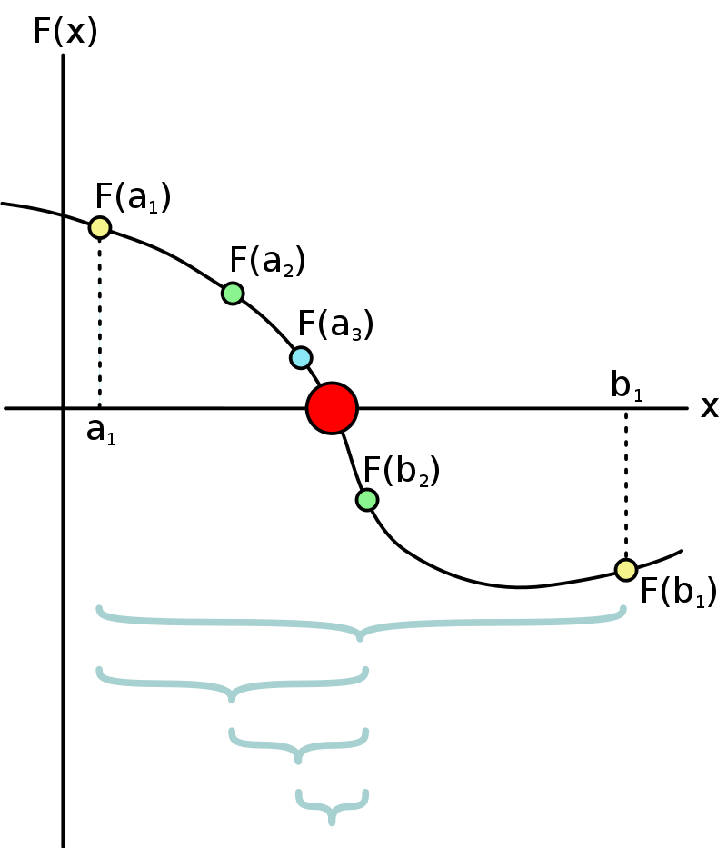
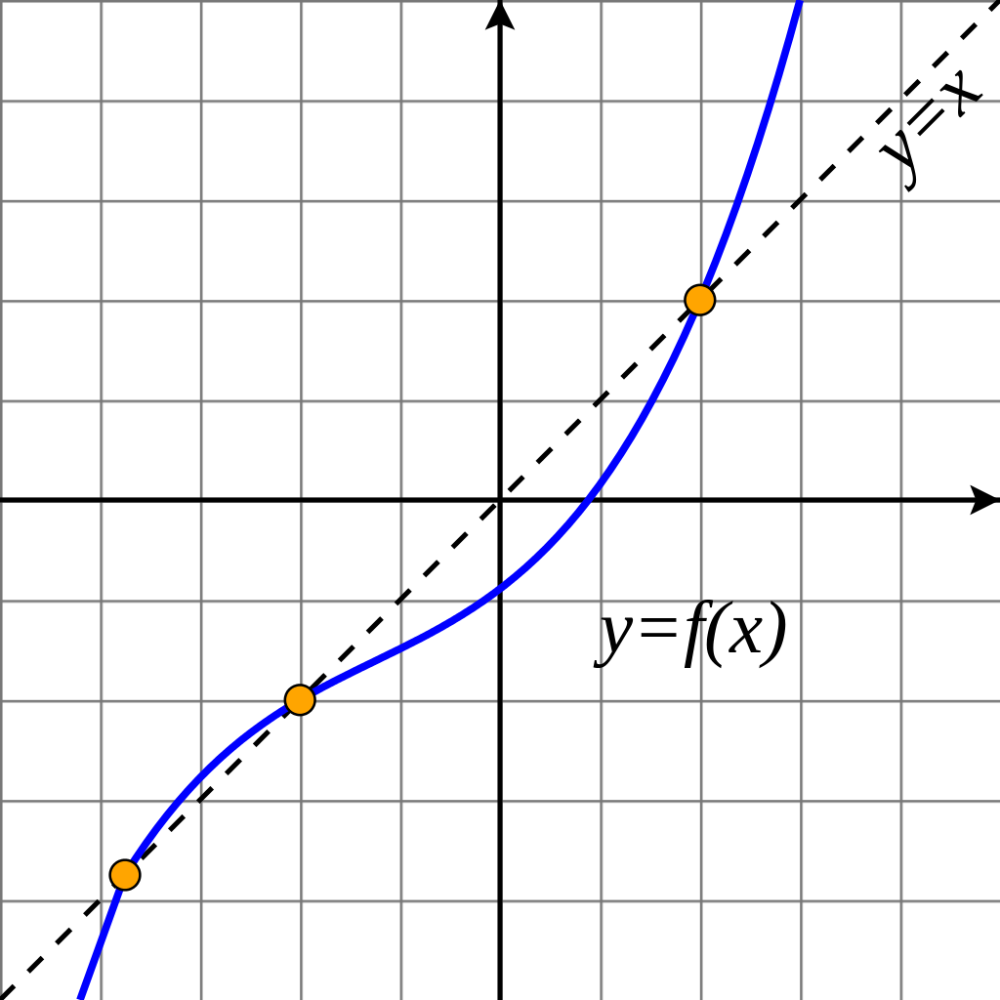
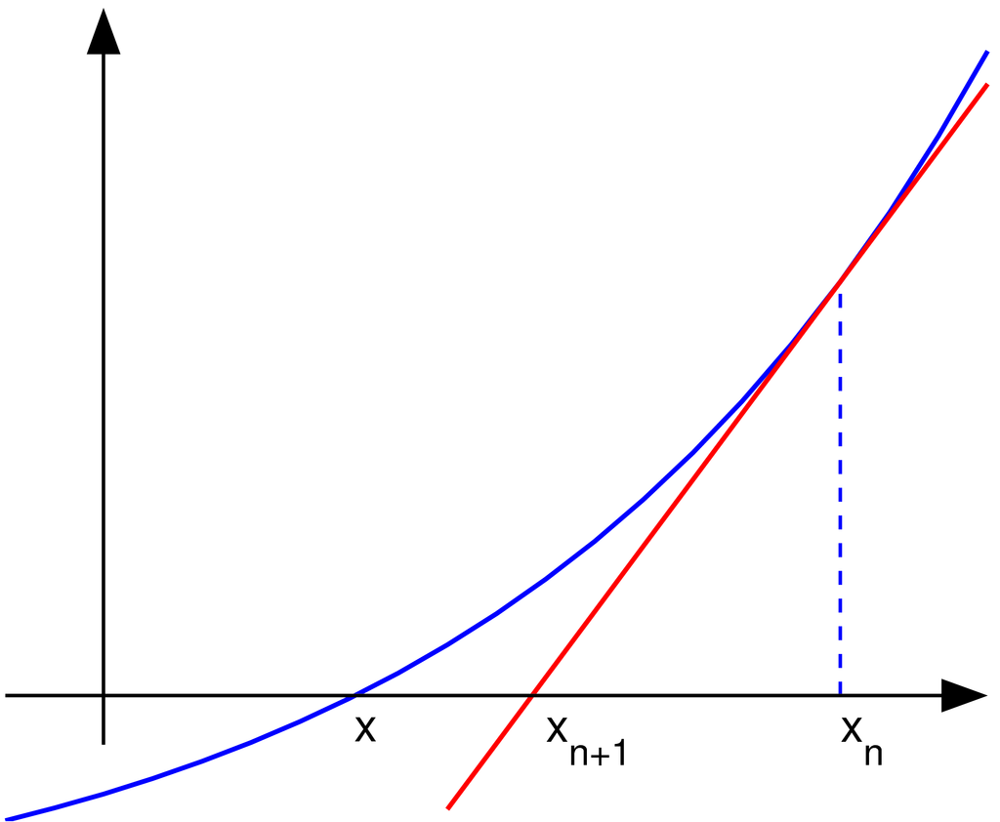

# AnalyseNum-rique

<!-- START doctoc generated TOC please keep comment here to allow auto update -->
<!-- DON'T EDIT THIS SECTION, INSTEAD RE-RUN doctoc TO UPDATE -->

- [Getting started](#getting-started)
- [environment](#environment)

<!-- END doctoc generated TOC please keep comment here to allow auto update -->
## les objectives: 
> Les objectives de ce tp sont: 
> + installation Anaconda et Octave en local
> + l'ajout du kernel d'octave/Matlab à jupyter notebook
> + apprendre a déterminer la méthode de dechtomie en python
> + apprendre a déterminer la méthode de point fixe en python
> + apprendre a déterminer la méthode de Newton en python

## méthode de déchtomie:
La méthode de dichotomie ou méthode de la bissection est, en mathématiques, un algorithme de recherche d'un zéro d'une fonction qui consiste à répéter des partages d’un intervalle en deux parties puis à sélectionner le sous-intervalle dans lequel existe un zéro de la fonction.

## méthode de point fixe:
En mathématiques, pour une application f d'un ensemble E dans lui-même, un élément x de E est un point fixe de f si f(x) = x.

## méthode de Newton:
En analyse numérique, la méthode de Newton ou méthode de Newton-Raphson1 est, dans son application la plus simple, un algorithme efficace pour trouver numériquement une approximation précise d'un zéro (ou racine) d'une fonction réelle d'une variable réelle.

## Requirements

* [ANACONDA For windows][ANACONDA] 
* [Octave][oct]
* [Jupyter][Jup]

