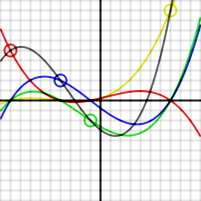

# AnalyseNum-rique

<!-- START doctoc generated TOC please keep comment here to allow auto update -->
<!-- DON'T EDIT THIS SECTION, INSTEAD RE-RUN doctoc TO UPDATE -->

- [Getting started](#getting-started)
- [environment](#environment)

<!-- END doctoc generated TOC please keep comment here to allow auto update -->

## Requirements

* [ANACONDA For windows][ANACONDA] 
* [Octave][oct]
* [Jupyter][Jup]

 ## objectives:
> Les objectives de ce tp sont: 
>  + la Détermination du polynome d'interpolation de lagrange avec python
> + apprende à programmer une fonction de phénomene de runge avec python
> + la Détermination du polynome du Newtopn avec python

## Interpolation de lagrange:
En analyse numérique, les polynômes de Lagrange, permettent d'interpoler une série de points par un polynôme qui passe exactement par ces points appelés aussi nœuds.

## phénomene de runge:
le phénomène de Runge se manifeste dans le contexte de l'interpolation polynomiale, en particulier l'interpolation de Lagrange. c'est la conséquence de deux propriétés du problème.

> + L'amplitude des dérivées de la fonction de Runge augmente très rapidement lorsque n augmente.
> + L'équi-répartition des points d'interpolation mène à une constante de Lebesgue qui augmente très rapidement lorsque n augmente.

## Interpolation newtonienne:
En analyse numérique, l'interpolation newtonienne, du nom d'Isaac Newton, est une méthode d'interpolation polynomiale permettant d'obtenir le polynôme de Lagrange comme combinaison linéaire de polynômes de la « base newtonienne ».
