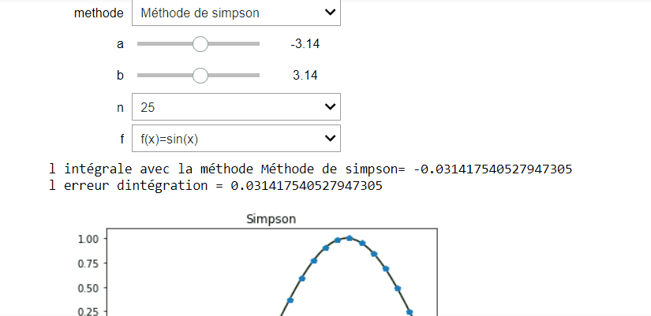

# AnalyseNum-rique
<!-- START doctoc generated TOC please keep comment here to allow auto update -->
<!-- DON'T EDIT THIS SECTION, INSTEAD RE-RUN doctoc TO UPDATE -->

En analyse numérique, il existe une vaste famille d’algorithmes dont le but principal est d’estimer la valeur numérique de l’intégrale définie sur un domaine particulier pour une fonction donnée , le but de ce tp est la réalisation d'un projet en utilisant le langage python qui génère les 4 méthodes d'intégration numérique (simpson, trapéze , point milieu et rectangle) et qui affiche l’intégration et l’erreur d’intégration et la courbe pour chaque méthode

## la méthode de simpson :
La méthode de Simpson est basée sur un polynôme de degré 2 (intégrale d’une parabole)
L’erreur globale est donnée par : E(ʄ)=-(b-a)^5/2880  ʄ^4 (ɳ)

## la méthode de trapéze :
En interpolant f par un polynôme de degré 1, les deux points d'interpolation (a, f (a)) et (b, f (b)) suffisent à tracer un segment dont l’intégrale correspond à l’aire d’un trapèze
L’erreur globale est donnée par : E(ʄ)=-(b-a)^3/12  ʄ''(ɳ)

## les méthodes de du rectangle et du point milieu :
C’est les méthodes les plus simple qui consistent à interpoler la fonction f à intégrer par une fonction constante

## conclusion :

| méthode | simpson         | trapéze           | point milieu      | rectangle        |
|---------|-----------------|-------------------|-------------------|------------------|
| ordre   | ordre 3         | ordre 1           | ordre 1           | ordre 0          |
| erreur  | précision élevé | précision moyenne | précision moyenne | précision faible |

